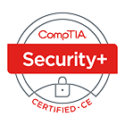

# Portfolio

#### Objective: A dedicated and detail-oriented IT professional with expertise in network security, endpoint management, and technical troubleshooting. Seeking to leverage hands-on experience and problem-solving skills to contribute innovative solutions and showcase technical projects that demonstrate proficiency in cybersecurity and system management.

## Certifications
- CompTIA Security+
- Google IT Support Certificate
   
  
## Skills
  -Experience with VMware and Oracle
  - PC, Linux, and Mac Operating Systems
  - Malware Threat Detection/Removal
  - Microsoft Office Suite
  - Microsoft defender Antivirus
  - Active Directory
  - TCP/IP
  - CCTV
  - Hardware/Software

## Work Experience
**Owner/Operator @ Professor Pressure LLC (_July 2022 - Present_)**
- Successfully established and managed a pressure washing business, overseeing marketing, client relations, scheduling, and financial management. 
- Handled administrative tasks including invoicing, bookkeeping, and customer service, ensuring smooth business
operations.
- Utilized various marketing strategies to grow the client base, resulting in a 110% revenue increase in the first year.
Maintained excellent relationships with clients through effective communication and timely service delivery.
-Provided high-quality exterior cleaning services, ensuring thorough and meticulous cleaning for residential and
commercial properties.

**Delivery Driver @ FedEx Ground (_September 2020 - June 2022_)**
- Ensured the timely and safe delivery of packages to businesses and residences, maintaining a high
level of customer satisfaction and adhering to company standards for delivery times. 
- Efficiently loaded and unloaded items from delivery vehicles, ensuring that all packages were handled with care and
transported securely.

## Projects
### [Secure Remote Access Configuration for Home CCTV System](projects/cctv_lab.md)
This project focuses on configuring and securing remote access for a home CCTV system by properly setting up port forwarding, understanding protocol differences (TCP/UDP), and assessing security implications. Additionally, we optimize NTP settings for time synchronization accuracy on the NVR.

